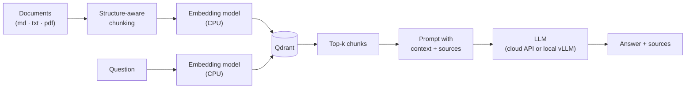

# ragbox

A small, self-hostable RAG system for your own documents. Bring your own LLM: cloud or local.

Built to explore production-grade RAG patterns: structure-aware chunking, a model-agnostic LLM interface, and an explicit "don't know" instead of a hallucinated answer.

## Demo

```
POST /ask
{ "question": "What is PagedAttention?" }

200 OK
{
  "answer": "PagedAttention is the attention algorithm vLLM uses to manage GPU
             memory for the key-value cache, similar to how an operating
             system manages memory pages.",
  "sources": ["vllm.md"]
}
```

*(Screenshot/GIF of the `/ui` page goes here.)*

## Features

- **Structure-aware chunking**: splits along headings and paragraphs instead of every N characters, so a chunk never cuts a sentence in half.
- **Bring your own LLM**: one interface, one implementation, that works against any OpenAI-compatible endpoint, a cloud API today or a self-hosted [vLLM](https://github.com/vllm-project/vllm) server tomorrow.
- **CPU-only embeddings**: [multilingual-e5-small](https://huggingface.co/intfloat/multilingual-e5-small) runs on CPU, no GPU required, and handles German and English equally well.
- **Answers say "I don't know"**: the system prompt and retrieval logic are built to admit when the ingested documents don't contain an answer, rather than let the model guess.
- **One command to run**: `docker compose up` starts Qdrant and the API together.

## Architecture



## Quickstart

Requires Docker and an API key for any OpenAI-compatible LLM endpoint (or a local vLLM server, see below; or a free option, see [Free, no-cost model options](#free-no-cost-model-options)).

```bash
git clone https://github.com/MaxNeumann1993/ragbox.git
cd ragbox
cp .env.example .env   # then add your LLM_API_KEY
docker compose up
```

In another terminal, ingest the bundled sample documents and ask a question:

```bash
./scripts/ingest_samples.sh

curl -X POST http://localhost:8000/ask \
  -H "Content-Type: application/json" \
  -d '{"question": "Why does RAG avoid fine-tuning?"}'
```

Or open [http://localhost:8000/docs](http://localhost:8000/docs) for interactive Swagger docs, or [http://localhost:8000/ui](http://localhost:8000/ui) for a minimal web UI.

## Configuration

All configuration lives in `.env` (see `.env.example`):

| Variable | Default | Description |
|---|---|---|
| `LLM_BASE_URL` | `https://api.openai.com/v1` | Any OpenAI-compatible base URL (a cloud API or a local vLLM server) |
| `LLM_API_KEY` | *(none)* | API key for the above endpoint. Local vLLM servers usually accept any non-empty string |
| `LLM_MODEL` | `gpt-4o-mini` | Model name, as expected by the endpoint above |
| `EMBEDDING_MODEL` | `intfloat/multilingual-e5-small` | Any [sentence-transformers](https://www.sbert.net/) model, downloaded and run locally on CPU |
| `QDRANT_URL` | `http://qdrant:6333` | Qdrant instance URL |
| `QDRANT_COLLECTION` | `ragbox` | Collection name used for storing chunks |
| `CHUNK_SIZE` | `800` | Target characters per chunk |
| `CHUNK_OVERLAP` | `100` | Characters carried over from one chunk into the next |
| `TOP_K` | `4` | Number of chunks retrieved per question |

### Using a local model (vLLM)

Because the LLM sits behind a single [`LLMProvider`](app/llm/base.py) interface talking to an OpenAI-compatible endpoint, switching to a self-hosted model is a config change, not a code change. Start a vLLM server exposing its OpenAI-compatible API:

```bash
python -m vllm.entrypoints.openai.api_server \
  --model mistralai/Mistral-7B-Instruct-v0.3 \
  --port 8001
```

Then point ragbox at it:

```env
LLM_BASE_URL=http://localhost:8001/v1
LLM_API_KEY=not-needed
LLM_MODEL=mistralai/Mistral-7B-Instruct-v0.3
```

No changes to `app/rag.py` or `app/llm/openai_compatible.py` are needed; the same request/response shape is used either way.

### Free, no-cost model options

You don't need a paid API key just to try ragbox. Several OpenAI-compatible endpoints work with no cost:

| Provider | `LLM_BASE_URL` | Notes |
|---|---|---|
| [Ollama](https://ollama.com) (local) | `http://localhost:11434/v1` | Fully free, runs on your own machine, no API key. Run `ollama pull llama3.2`, then set `LLM_MODEL=llama3.2`. The simplest way to try ragbox with zero cloud dependency. |
| [Groq](https://groq.com) | `https://api.groq.com/openai/v1` | Free tier with fast inference on open-weight models. |
| [Google Gemini](https://ai.google.dev) | `https://generativelanguage.googleapis.com/v1beta/openai/` | Free tier for Gemini models through its OpenAI-compatible endpoint. |
| [OpenRouter](https://openrouter.ai) | `https://openrouter.ai/api/v1` | Aggregates many providers; some models are marked free (look for a `:free` suffix). |

Free tiers, limits, and terms change often, so check each provider's current pricing page before relying on one. Since all of them speak the same chat-completions format, switching between a free provider, a paid one, or a local vLLM server is still just the three `LLM_*` variables in `.env`.

## How it works

**Chunking** splits on headings and blank lines rather than a fixed character count ([app/chunking.py](app/chunking.py)). A heading becomes a breadcrumb (e.g. `RAG > Avoiding hallucination`) that's prepended to the chunk before embedding, so the chunk carries its own context even in isolation. Paragraphs are combined up to `CHUNK_SIZE` and only split mid-paragraph as a last resort, on sentence boundaries.

**Retrieval** embeds the question with the same model used for indexing (with the `query:` / `passage:` prefixes E5 models expect) and asks Qdrant for the `TOP_K` nearest chunks by cosine similarity ([app/retriever.py](app/retriever.py)).

**Answering** builds a prompt from the retrieved chunks, labeled by source file, and instructs the LLM to answer only from that context ([app/rag.py](app/rag.py)). If retrieval finds nothing (for example, before anything has been ingested), the API returns a fixed "I don't know" response without calling the LLM at all, rather than letting the model improvise.

## Design decisions

- **One `LLMProvider` interface, one implementation.** Rather than build separate integrations per provider, `OpenAICompatibleProvider` just varies `base_url`/`api_key`/`model`, because vLLM, and most self-hosted inference servers, already speak the OpenAI API shape.
- **Embeddings run locally, the LLM doesn't have to.** Embedding every chunk is the highest-volume, most latency-sensitive part of ingestion; keeping it local and CPU-only means ingestion never depends on network calls or a paid API.
- **Chunk boundaries follow document structure, not a token budget.** A fixed-size slider is simpler to implement but regularly splits a sentence or a list item across two chunks, which hurts both embedding quality and how coherent the retrieved context reads to the LLM.
- **A missing answer is a valid answer.** RAG systems that always produce a confident-sounding response make it hard to tell a real answer from a hallucinated one; short-circuiting on empty retrieval and instructing the LLM to defer to "I don't know" makes the failure mode visible instead of silent.

## Roadmap

Deliberately out of scope for v1, in rough order of likely follow-up:

- Reranking retrieved chunks before building the prompt
- An evaluation suite (question/expected-answer pairs, scored automatically)
- A richer frontend (this repo currently ships a single static HTML page)
- Multiple simultaneous LLM/embedding backends
- User accounts and auth

## License

[MIT](LICENSE)
